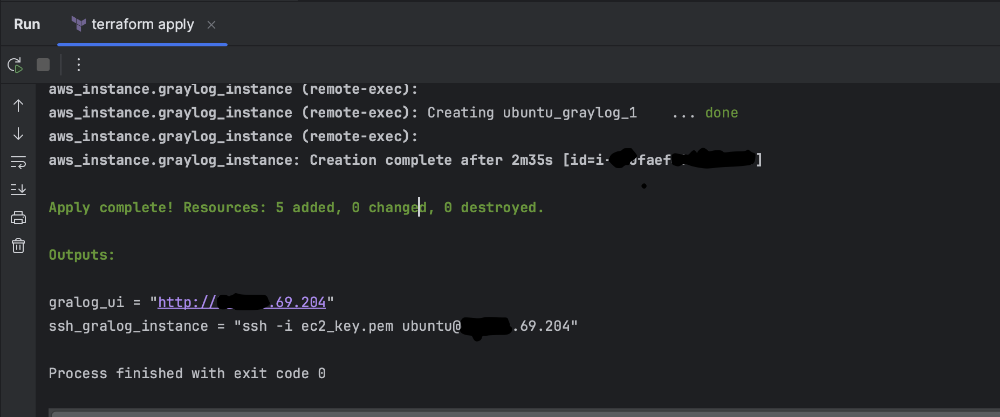
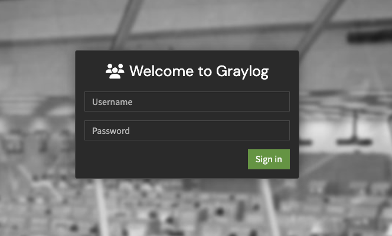
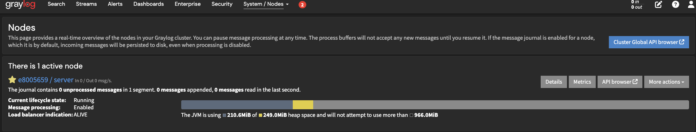
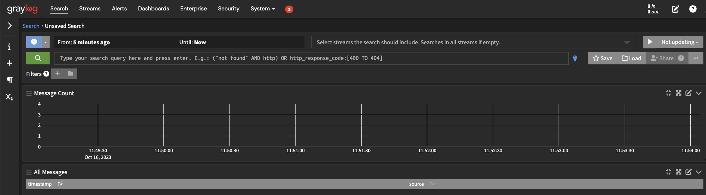

# Setting up Graylog on an AWS EC2 instance using Terraform and Docker Compose

Quick and easy setup for your test environment.

---
## Usage
1. You should first change the ```vpc_id``` and the ```public_subnet_id```(vars.tf)
2. terraform plan
3. terraform apply

---
## Outputs



---

## Screenshots

<br>
<br>

<br>
<br>
